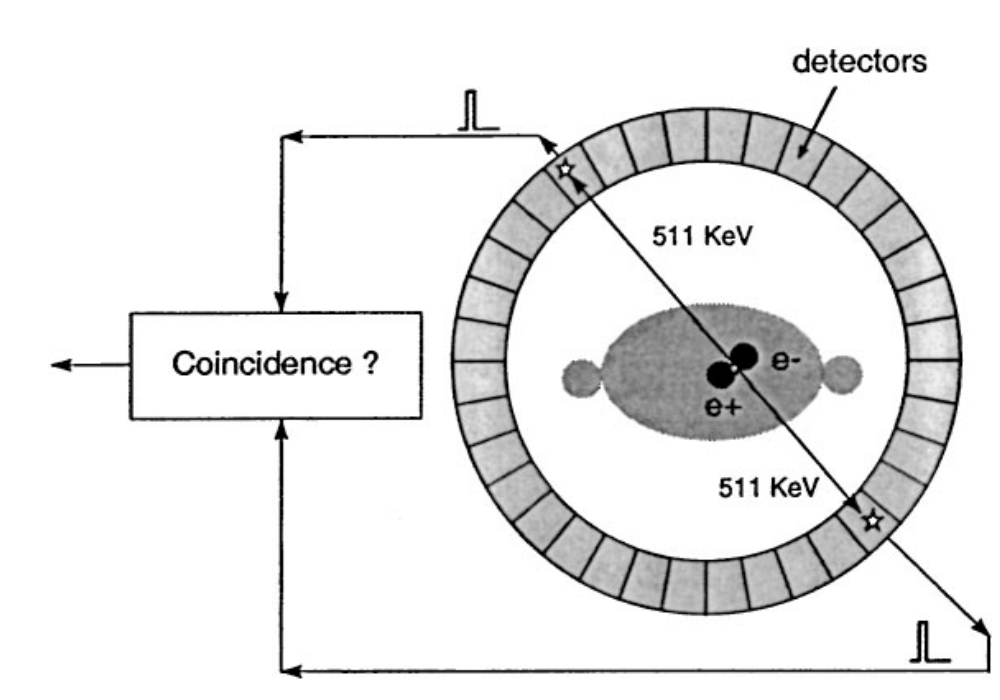
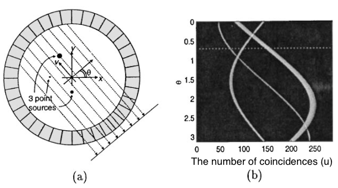
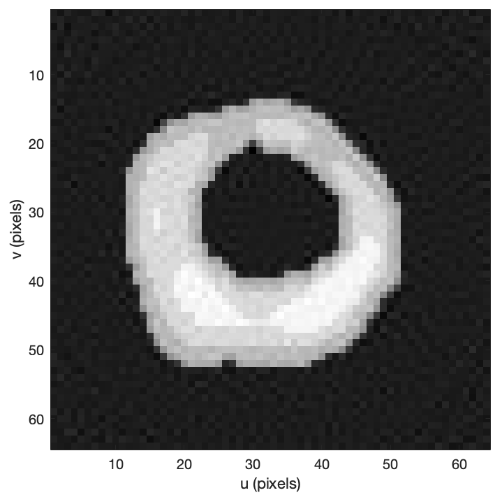
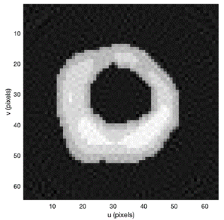
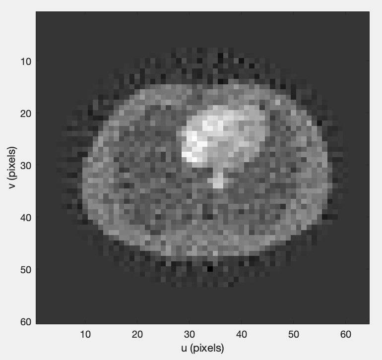

# A positron emission tomography (PET) simulator: an effective way to learn filters with MATLAB

## **Introduction**

The toolbox provides handy tools to study filtering technology, e.g., Kalman
filter, ensemble Kalman filter, and $H_{\infty }$ filter. The interface is also reserved for
other estimation technologies, such as expectation-maximization (E-M) and
filtered back projection (FBP) algorithms. It simulates a PET system and
generates the results of the scan (or called sinogram data). After been
processed by a reconstruction algorithm, the result will be the image of the
patient’s body, which is precisely the one that the doctor will observe at the
end of a health check. The standard reconstruction technologies are FBP or E-M.
Recently, the deep learning method dramatically improved image quality. With the
help of the simulator, traditional filtering technologies can be practiced.
Compared with the exercises in the textbook, the simulator has the following
advantages.

-   **Facility Parameters.** The parameters, which are required by the
    algorithms, can be directly retrieved. For example, after typing the predict
    equations and the update equations from a textbook, the result will follow.
    The common mistakes, e.g., mismatched matrix dimensions, will be
    automatically detected by the simulator.

-   **Bad results but not discouraging.** The noise embedded in the PET system
    is non-Gaussian. Although the toolbox can supply a linear version of the PET
    model, the result can still be bad. It keeps our heads clear after the
    textbook shows the beautiful math of the Kalman filter and the elegant
    orthogonal projection behind these equations. There are differences between
    the theoretical hypothesis and the physical system. The simulator also
    preserves interfaces that can formally implement the filters. The results
    from formally implementing and informally implementing can be compared.

-   **Calculation speed depending on the size of the problem.** The simulator
    can generate high-resolution sinogram data; however, the time required by
    reconstructing the image increases significantly. It demonstrates that the
    reconstruction algorithm should be accurate; however, it also requires
    efficiency. A patient suffering cerebral infarct may die after waiting days
    for PET results.

## **Preliminaries**

The PET is an advanced examination that becomes more accurate when combined with
Computed Tomography (CT). However, people do not usually need it in the local
area because the PET is not covered by medical insurance. It is usually too late
when the doctor believes that a person has cancer and suggests a PET-CT.
However, the PET examination in a rich country saves lives.

The general process is as follows. The doctor gives the patient an injection;
then, the patient starts to shine like a bulb. The medicine injected into the
body is radioactive; however, it will be rapidly metabolized without leaving any
harm. On the contrary, the medicine gathers in the metabolically active area,
e.g., a malignant tumor, during the short stay in the body. Unfortunately, human
eyes cannot see the light emitted from the body. It is why we need the physical
basis of PET (Figure 1, [1]), whose main component is a ring of detectors. The
light excited by the medicine is made of pairs of high-energy (511 keV) photons.
The photons travel in opposite directions along a straight-line path; then, they
arrive at the associated detector in the ring almost simultaneously. Now, we can
count the times of coincidences, which are the sinogram data. Soon, the data are
used to reconstruct the figure of the body.

Figure 1 [1]. The physical basis for PET. A positron and an electron produce a
pair of 511 keV photons detected by a pair of scintillation detectors.

Here is an explanation about why the number of coincidences is called the
sinogram data. Suppose that there are three tumors in the body. Each one will
give a Sine-like waveform, as shown in Figure 2 [1]. Along with direction v, the
associated two detectors record most of the coincidence events. The event
becomes rare when deviating from the direction.

Figure 2 [1]. Coincidence detection between parallel pairs of detectors in (a)
corresponds to one line of the Radon transform of the source distribution in
(b). A point source in (a) maps to a sinusoid in Radon transform space (b).

From a stochastic perspective, the number of recorded coincidence events obeys
the Poisson distribution. Let us consider that each $x_j$ is the density of one block
in the patient’s body. The target is to estimate density ${\hat{x}}_j$, so we can draw a
figure. The doctor will research it. From Figure 2, we know each block has a
chance to contribute the total number of coincidence events detected by a pair
of detectors. The chance is different depending on the relative position of the
block and the detector pair. We give each $x_j$ a parameter $c_{ij}$ to describe the
difference. On average, each detector pair should record $E\left(y_i\right)$ times of events, which
is Equation (1).
$$ {\bar{y}}_i=E\left(y_i\right)=\sum_{j=1}^{n}{c_{ij}x}_j \tag{1}$$
The average times of events detected by total M detector pairs can be written in
the matrix form of Equation (2).
$$ \bar{Y}=E\left(Y\right)=CX \tag{2}$$
After the physical basis for PET was made, we can perform many experiments and
calculate the matrix C. The random variable $y_i$ is Poisson with mean ${\bar{y}}_i$ and
distribution of Equation (3), which describes the probability of isolated
coincidence event that occurs times in a fixed interval of time.
$$ p\left(y_i\middle| X\right)=e^{-{\bar{y}}_i}\frac{{{\bar{y}}_i}^{y_i}}{y_i!} \tag{3}$$
For the complete sinogram data, we assume that m pairs of detectors work
independently. So, we multiply them together, which gives Equation (4).
$$ p\left(Y\middle| X\right)=\prod_{i=1}^{m}{e^{-{\bar{y}}_i}\frac{{{\bar{y}}_i}^{y_i}}{y_i!}} \tag{4}$$

## **Attempt 1: The blind application of the Kalman filter**

The Kalman filter is utilized a lot. Although not recommended, we do not
precisely know the actual noise model in many usages. The truth is that the
Kalman filter adapts well, as we may do on the PET system.

The usage of the Kalman filter follows the following assumptions. Assuming that
the patient’s body is static during the PET examination, we have the system
model (5).
$$ X(k+1)=X(k) \tag{5}$$
It is too strict because the patient is alive instead of a piece of frozen meat.
Then, it follows the observation model (6).
$$ Y(k)=CX(k)+\eta(k) \tag{6}$$
By ignoring the truth that the sinogram data $Y(k)$ obey the Poisson distribution, we
assume that $\eta(k)$ is Gaussian. Of course, The covariance matrix R of the measurement
noise is unknown, which has to be optimized by the trial-and-error method.

The simulator makes the process less painful. There are two scanners in the
‘+Scanner’ folder. The ‘ZJU_Scanner’ generates sinogram data corrupted by
Gaussian noise, strictly following Equation (6). So, the implementation of
Kalman Filter with the scanner is formal. See the example m file ‘Scan_ZJU_KF.’
After completing the test with the scanner, the program can be migrated to use
the ‘PETCT_Scanner.’ The latter generates Poisson sinogram data, as we have
discussed.

Figure 3 shows the results of m file ‘Scan_ZJU_KF.’

Figure 3. The results generated by a formal implementation of the Kalman filter.
The covariance matrix of the measurement noise is $R=1.26I$, which gives $RMSE\ =\ 0.45391$ and $Bias=0.00018$.

## **Attempt 2: increasing the reliability with $ {H}_\infty$ filter**

The Kalman filter in the first attempt can work partly because of luck. We use
the Poisson sinogram data as they are Gaussian. We have no way to guarantee that
a patient causes the filter to diverge one day, and the doctor will feel
embarrassed. Luckily, there are filtering technologies that have no assumption
on the noise characteristic, e.g., $H_\infty$ filter.

The $H_\infty$ filter also uses the observation model (6); however, $\eta(k)$ is assumed as the noise
taking unknown characteristics. It is better than the Gaussian assumption.
Having no assumption is better than making mistakes.

The $H_\infty$ filter reconstructs the sinogram data by solving an optimization problem.
Ideally, it finds the figure of the patient’s body $\hat{X}$ that satisfies Function (7),
which constraints the initial state $X\left(0\right)$ and the states of the entire operating cycle
($X\left(1\right)$ to $X\left(K-1\right)$) [2].
$$ J_1=\frac{\sum_{k=0}^{K-1}{\left(X\left(k\right)-\hat{X}\left(k\right)\right)^\ast\left(X\left(k\right)-\hat{X}\left(k\right)\right)}}{\left(X\left(0\right)-\hat{X}\left(0\right)\right)^\ast P(0)\left(X\left(0\right)-\hat{X}\left(0\right)\right)+\sum_{k=0}^{K-1}{\eta^\ast\left(k\right)\eta\left(k\right)}}<\gamma \tag{7}$$
The estimation $\hat{X}\left(k\right)$ can be written in a recursive form as Kalman filter (Functions
(8), (9), and (10)).
$$\hat{X}\left(k+1\right)=\hat{X}\left(k\right)+P\left(k\right)C^\ast\left(I+CP\left(k\right)C^\ast\right)^{-1}\left(Y\left(k\right)-C\hat{X}\left(k\right)\right) \tag{8}$$
$$P\left(k+1\right)=P\left(k\right)-P\left(k\right)\left[\begin{matrix}C^\ast&I^\ast\\\end{matrix}\right]R_{e,j}^{-1}\left[\begin{matrix}C\\I\\\end{matrix}\right]P\left(k\right) \tag{9}$$
$$ R_{e,j}=\left[\begin{matrix}I&0\\0&-\gamma^2I\\\end{matrix}\right]+\left[\begin{matrix}C\\I\\\end{matrix}\right]P\left(k\right)\left[\begin{matrix}C^\ast&I^\ast\\\end{matrix}\right] \tag{10}$$
However, keep in mind that a too-small $\gamma$ will not force the $H_\infty$ filter find an
estimate $\hat{X}\left(k\right)$ that is very close to the $X\left(k\right)$. On the contrary, optimization problem (7)
will have no solution. In this condition, we can still use Functions (8), (9),
and (10) to calculate something; however, the result is meaningless and maybe
worse than the results with big $\gamma$. So, whether the $\gamma$ is appropriate should be
monitored with Function (11).
$$P_k^{-1}+C^\ast C-\gamma^{-2}>0 \tag{11}$$

The price of unwillingness to understand the characteristic detail of the noise
is the additional computational burden. In order to reduce the waiting time of
the patients, Functions (9) and (10) can be calculated offline, and so is the
testing of appropriate $\gamma$ with Equation (11). However, for our low-resolution
simulation, the data should be store after the offline calculation has reached
up to several GB in size. In reality, it needs unique technology to read massive
data from the hard drive because the resolution required for the diagnosis will
be much higher than simulation. By the way, calculating the estimate with
Equation (8) is also slow.

Figure 4 shows the results of the m file ‘Scan_ZJU_HinfF.’ On the first run, it
will complete the offline calculation. Comment out the 14th line to experience
the performance improvement for the rest of the runs. With the help of the
offline calculation, the required time is similar to the speed of the Kalman
filter.

Figure 4. The results of $H_\infty$ filter, with RMSE = 0.78567 and Bias=-0.21228.

## **Attempt 3: transforming noise**

The Poisson variable $y_i$ can be transformed into Gaussian with Equation (12) [3],
which has constant variance $y_i$, if $c=\frac{3}{8}$.
$${\widetilde{y}}_i=\sqrt{y_i+c} \tag{12}$$
Then, we can rewrite the observation of state $x_i$ with Equation (13), where $v_i$ is a
Gaussian noise with a variance of 0.25.
$${\widetilde{y}}_i=\sqrt{C_iX+c}+v_i \tag{13}$$
Now, square both sides of Equation (13). We have Equation (14), where new noise $s_i$
is Equation (15).
$$z_i={{\widetilde{y}}_i}^2=C_iX+c+s_i \tag{14}$$
$$s_i=2v_i\sqrt{C_iX+c}+v_i^2 \tag{15}$$
Noise $s_i$ is not zero-mean Gaussian; however, it can be well approximated by a
Gaussian pdf with matching first and second-order moments [4]. So, we have
Equations (16), (17), (18), (19), and (20).
$$Z=CX+cI+S \tag{16}$$
$$ S\sim N\left(\bar{S},\Sigma\right) \tag{17}$$
$$ {\bar{s}}_i=E\left(s_i\right)=R_{ii} \tag{18}$$
$$ \Sigma_{ii}=E\left(s_i-{\bar{s}}_i\right)^2=R_{ii}\left(4y_i^2+2R_{ii}\right) \tag{19}$$
$$ \Sigma_{ii}=E\left(s_i-{\bar{s}}_i\right)(s_j-{\bar{s}}_j)=R_{ij}\left({4y}_iy_j+2R_{ij}\right) \tag{20}$$
We end with a standard linear equation of observations with Gaussian noise,
which the Kalman filter can use.

According to Nikolas et al.’s naming rule [4], we may name it the
squared-distances Kalman (SD-Kalman) filter. Implementing the SD-Kalman filter
can be found in the m file ‘Scan_SDKF.’ Figure 5 shows the results.

Figure 5. The results of squared distances Kalman filter, with RMSE = 0.28712
and Bias= -0.03383.

###### Attempt 4: fast calculation with ensemble Kalman filter

The Kalman filter has a Monte-Carlo implementation [5]. If the computer has
multiple cores, the calculation speed can be improved.

The ensemble Kalman filter assumes no need to calculate the state covariance. It
can be estimated by independently maintained massive state vectors (ensemble).
Suppose that we have ensemble $\mathcal{X}$, which is Equation (21).
$$\mathcal{X}=\left[X_1,\cdots,X_N\right]=\left[X_i\right] \tag{21}$$
Each $X_i$ is a state vector as we are used in Equations (5) and (6). Since $X_i$ is a
sample from the prior distribution, and there are a lot of $X_i$. The mean and
covariance can be calculated with Equations (22) and (23) as long as we need,
where matrix A is Equation (24).
$$E\left(\mathcal{X}\right)=\frac{1}{N}\sum_{k=1}^{N}X_k \tag{22}$$
$$P=\frac{AA^T}{N-1} \tag{23}$$
$$A=\mathcal{X}-E\left(\mathcal{X}\right)=\mathcal{X}-\frac{1}{N}\left(\mathcal{X}e_{N\times1}\right)e_{N\times1}^T \tag{24}$$

Accordingly, supposing that the measurement is vector Y with covariance R, we
fabricate N measurements for each state $X_i$ by Equations (25) and (26). The
disturbance $n_i$ is a random vector from normal distribution $N(0,R)$.
$$\mathcal{Y}=\left[Y_1,\cdots,Y_N\right]=\left[Y_i\right] \tag{25}$$
$$Y_i=Y+n_i \tag{26}$$

In the end, each $X_i$ can be independently maintained or written in a matrix form
(22) through a standard Kalman updated procedure (27).
$$\hat{\mathcal{X}}=\mathcal{X}+PC^T\left(CPC^T+R\right)^{-1}\left(\mathcal{Y}-C\mathcal{X}\right) \tag{27}$$

The ensemble technology can be mixed with the SD-Kalman filter, which is called
the EnSD-Kalman filter. An implementation can be found in m file ‘Scan_EnSDKF,’
which gives Figure 6.

Figure 6. The results of ensemble squared distances Kalman filter with RMSE =
0.38253 and Bias= 0.04570.

## **Simulator**

The PETCT Scanner is based on Michigan Image Reconstruction Toolbox (MIRT),
built by Fessler et al. and can be downloaded from
[http://web.eecs.umich.edu/\~fessler/code/index.html](http://web.eecs.umich.edu/~fessler/code/index.html).
The simulator contains an old version of the MIRT to keep the compatibility.
This version is sufficient to support the simulator but may be incomplete
because of the unstable internet connection.

The reason that we do not start from the MIRT is that it needs time to get
started. The MIRT is full-featured and designed for all aspects of the
reconstruction technology.

The beginner often mixes the codes related to the PET scanner, the sinogram
data, and the reconstruction algorithms. In the end, try to write a giant
puzzling m file. In contrast, the objects are isolated in different namespaces
or folders in this simulator. For example, kinds of scanners are collected in
one folder. They all generate sinogram data, which is saved in another. The
reconstruction algorithms are in the Filter folder. Other helper objects are
also classified.

Numerous attributes associated with one object are also confusing in MIRT.
Additionally, most of them are served for other reconstruction algorithms rather
than the filtering technology. However, in the current simulator, the naming for
the attributes follows the standard rules of filtering technology [6].

To improve the speed, the MIRT contains many MEX filters. These files are
executable programs that are coded by C but can run in MATLAB. However, they are
built in a MAC computer, so they have to be rebuilt in Windows if one is not
rich enough to own a MAC. Unfortunately, the rebuilding process often encounters
errors. Luckily, the simulator avoids using the MEX file-related functions from
the MIRT.

The related source file in ZJU Scanner is provided by professor Hongxia Wang
[7], an expert in filtering technology. The related questions may consult her.

The simulator relies on the Machine Vision Toolbox (MVT) to enhance the visual
effect of the results. The toolbox built by professor Peter Corke can be
downloaded from <https://petercorke.com/toolboxes/machine-vision-toolbox>.

Initializing the simulator is easy. It contains no modification on the MIRT and
will not remain any permanent change on the MATLAB. Put the folder that contains
the simulator and the irt folder that contains the MIRT toolbox in the same
folder. Then, set the current path of the MATLAB to the simulator folder and run
the m file BlueBird_Setup. The file will register all the objects and commands
that belong to the simulator and the MIRT. All of them can be used instantly.
One can uncomment line 26 to rebuild the MEX files in MIRT. After the MATLAB is
closed, all these settings are removed.

## **Acknowledgment**

The author thanks professor Hongxia Wang who provided the knowledge about $H_\infty$
filtering and how to use filtering technology to reconstruct the figure. Also,
thanks to Fessler et al. and professor Peter Corke built MIRT and MVI, which
significantly simplifies the development of the simulator.

Wish you a good luck.

Blue Bird

bluebirdhouse@icloud.com

## **References**

[1] R. M. Leahy and J. Qi, "Statistical approaches in quantitative positron
emission tomography," *Statistics and Computing,* journal article vol. 10, no.
2, pp. 147-165, 2000, doi: 10.1023/a:1008946426658.

[2] B. Hassibi, A. H. Sayed, and T. Kailath, "Indefinite-quadratic estimation
and control. A unified approach to $H_2$ and $H_\infty$," *Society for
Industrial & Applied Mathematics Philadelphia Pa,* 1999.

[3] F. J. Anscombe, "THE TRANSFORMATION OF POISSON, BINOMIAL AND
NEGATIVE-BINOMIAL DATA," *Biometrika,* vol. 35, no. 3-4, pp. 246-254, 1948.

[4] N. Trawny and S. I. Roumeliotis, "On the global optimum of planar,
range-based robot-to-robot relative pose estimation," 2010 2010: IEEE, pp.
3200–3206.

[5] J. Mandel, "A brief tutorial on the ensemble Kalman filter," *arXiv preprint
arXiv:0901.3725,* 2009.

[6] C. K. Chui and G. Chen, *Kalman Filtering with Real-Time Applications*.
Springer Berlin Heidelberg, 2014.

[7] H. Wang, X. Chen, and L. Yu, "PET Image Reconstruction Based on a
Constrained Filter," *IFAC Proceedings Volumes,* vol. 47, no. 3, pp. 5503-5507, 2014, doi: http://dx.doi.org/10.3182/20140824-6-ZA-1003.01375.
